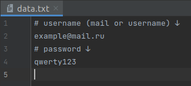
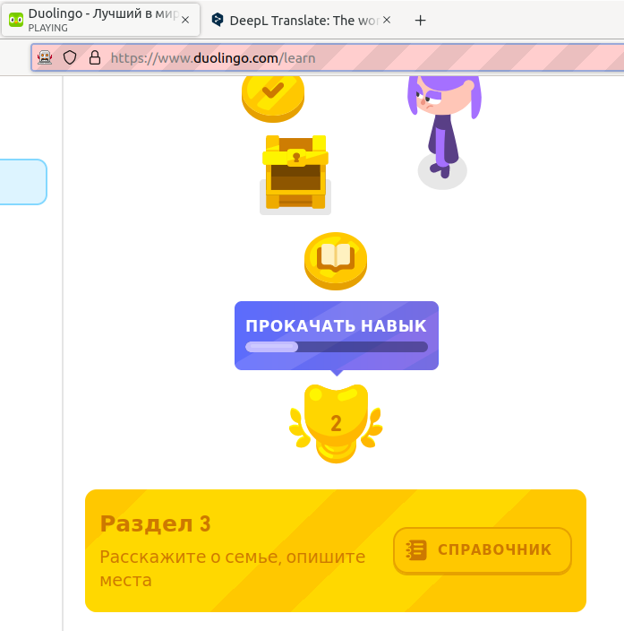
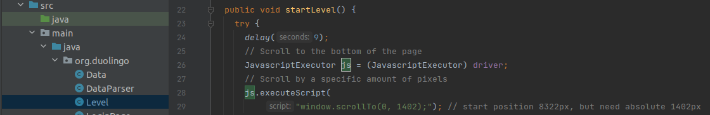

# Duolingo

## Hello! This program serves to automatically earn experience in Duolingo.
## Experience is earned by not completely passing the legendary level for which we get 20 exp.

### This project uses `Java, Maven, Selinium ` as well as the translator `DeepL`.

### Also from the patterns here are POM and Singleton.

## Setting up

### Step 1

### In order for the program to log in with your account, you need to enter your username and password in the data.txt.

### Step 2

### For the program to be able to find a legendary level for a quick pass, we need to specify the position in the `startLevel` method of the `Level` class. In my case, I set the position to `1402` to start the legendary level of section 2, because it is the fastest to pass.

## Run

### To run the program you can download the project to your desktop, move Duolingo.sh to `$HOME` and run it with sh Duolingo.sh. Or run it in your favorite IDE `:)`
